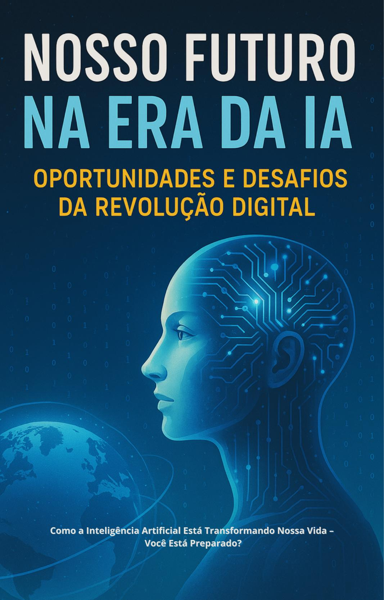

# 📘 Nosso Futuro na Era das IAs

**Desafios, oportunidades e o impacto dessa revolução em nossas vidas. Você está preparada?**

---

## ✍️ Descrição

Este e-book nasceu como resultado do meu aprendizado na trilha de Inteligência Artificial pela Digital Innovation One (DIO). Com linguagem acessível, o material aborda os impactos da IA em áreas como mercado de trabalho, educação, comportamento social, ética e uso prático no dia a dia.

---

## 👤 Quem Sou Eu

Me chamo Priscila e sou uma pessoa apaixonada por música, área na qual atuo profissionalmente. Mesmo sem base anterior na tecnologia, me desafiei a explorar novos conhecimentos nesta área, e este projeto é fruto desse esforço e curiosidade.

---

## 🎯 Objetivos do E-book

- Refletir sobre os impactos atuais da Inteligência Artificial.
- Estimular o pensamento crítico e ético no uso da tecnologia.
- Apresentar ferramentas e possibilidades acessíveis a todos.

---

## 🧠 Ferramentas Utilizadas

| Ferramenta     | Finalidade                                  |
|----------------|----------------------------------------------|
| ChatGPT        | Pesquisa, organização de conteúdo, imagens   |
| Canva          | Diagramação e estrutura visual do e-book     |
| GitHub         | Armazenamento e publicação                   |

---

## 📥 Acesse o E-book

📄 [Clique aqui para visualizar ou baixar o PDF]([./ebook.pdf](https://github.com/MirandaPri/DesafioDIO1/commit/951aa2b2e9d460972845bdcd64df0ad0ea2fbe83))

---

## 🖼️ Capa do E-book

---

## 📌 Tópicos Abordados

- O que é inteligência artificial?
- Mitos e verdades sobre a IA
- O impacto no mercado de trabalho e na sociedade
- Ética, privacidade e responsabilidade
- Como usar a IA no dia a dia (estudantes, profissionais, idosos, empreendedores)
- Ferramentas gratuitas recomendadas
- Reflexão final sobre o futuro e a consciência digital

---

## 🧾 Licença

Projeto sob licença MIT. Livre para uso e compartilhamento, desde que citada a autoria.

---

## 📬 Contato

- GitHub: [@MirandaPri](https://github.com/MirandaPri)

---

> _Este projeto foi desenvolvido como parte do desafio da DIO sobre uso de IA aplicada à documentação e geração de conteúdo._
